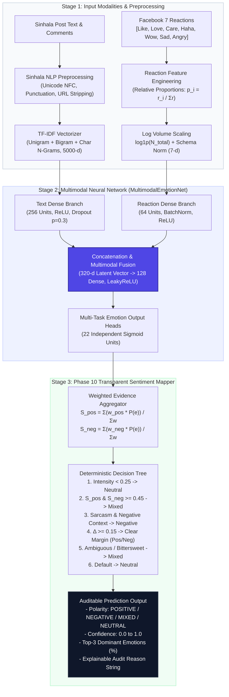
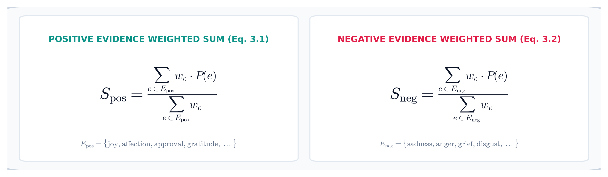

# ReactionFusion: Final Model System Architecture

This document specifies the technical architecture of the **ReactionFusion Multimodal Neural Emotion & Sentiment Inference System**, combining the **`MultimodalEmotionNet`** dual-branch neural feature fusion network with the **Phase 10 Rule-Based Explainable Sentiment Decision Tree**.

---

## 1. High-Level Architectural Diagram


*(A scalable vector version is available in [`model_architecture.svg`](model_architecture.svg).)*

### Conceptual Flow (Mermaid)



---

## 2. Stage 1: Input Modalities & Preprocessing

### 2.1 Text Preprocessing Pipeline
1. **Unicode NFC Normalization**: Unifies heterogeneous Sinhala vowel signs (`kombuva`, `al-lakuna`, and independent vowels) into deterministic Unicode representations.
2. **Text Sanitation**: Strips URLs, hashtags, user mentions, and repetitive punctuation sequences while preserving emotionally significant punctuation (`!`, `?`).
3. **TF-IDF Subword Vectorization**: Maps Sinhala vocabulary into a 5,000-dimensional sparse feature vector using word unigrams, bigrams, and character 3-5 n-grams to capture Sinhala agglutinative suffixes.

### 2.2 Reaction Vector Engineering
Raw counts across Facebook's seven distinct emotional reactions are extracted:
$$\\mathbf{r} = [r_{\\text{like}}, r_{\\text{love}}, r_{\\text{care}}, r_{\\text{haha}}, r_{\\text{wow}}, r_{\\text{sad}}, r_{\\text{angry}}]$$

1. **Relative Proportions**: Eliminates absolute scale variance across posts:
   $$p_i = \\frac{r_i}{\\max(1, \\sum_{k=1}^{7} r_k)}$$
2. **Logarithmic Engagement Scaling**: Preserves social engagement magnitude:
   $$V = \\log(1 + \\sum_{k=1}^{7} r_k)$$
3. **Schema Invariance**: Normalized to support uppercase database enums (`LIKE`, `LOVE`) and lowercase client objects.

---

## 3. Stage 2: MultimodalEmotionNet Architecture

The neural network fuses textual and social crowd signals through parallel representation branches:

| Layer Component | Input Dimension | Output Dimension | Activation / Operations | Regularization |
| :--- | :--- | :--- | :--- | :--- |
| **Text Branch** | 5,000 (TF-IDF) | 256 | Linear $\\to$ ReLU | Dropout ($p = 0.3$) |
| **Reaction Branch** | 7 (Norm Reactions) | 64 | Linear $\\to$ BatchNorm $\\to$ ReLU | Batch Normalization |
| **Concatenation Layer** | 256 + 64 | 320 | Vector Concatenation | N/A |
| **Multimodal Fusion Layer** | 320 | 128 | Dense $\\to$ LeakyReLU ($\\alpha = 0.1$) | Dropout ($p = 0.2$) |
| **Multi-Task Output Heads** | 128 | 22 | Dense $\\to$ Sigmoid | Multi-Label BCE Loss |

### Multi-Label Loss Formulation
$$\\mathcal{L}_{\\text{BCE}} = -\\frac{1}{22} \\sum_{i=1}^{22} \\left[ y_i \\log P(e_i) + (1 - y_i) \\log (1 - P(e_i)) \\right]$$
Where $y_i \\in \\{0, 1\\}$ represents ground truth annotations validated by native Sinhala human annotators.

---

## 4. Stage 3: Phase 10 Explainable Sentiment Mapper

Rather than using an opaque softmax layer, the final polarity is derived through a mathematically transparent, auditable decision engine:

### 4.1 Weighted Evidence Calculation



$$S_{\text{pos}} = \frac{\sum_{e \in E_{\text{pos}}} w_e \cdot P(e)}{\sum_{e \in E_{\text{pos}}} w_e}, \quad S_{\text{neg}} = \frac{\sum_{e \in E_{\text{neg}}} w_e \cdot P(e)}{\sum_{e \in E_{\text{neg}}} w_e}$$

* **Positive Weights ($w_e$)**: `joy`: 1.0, `affection`: 0.8, `approval`: 0.8, `gratitude`: 0.8, `pride`: 0.7, `hope`: 0.7, `excitement`: 0.7, `relief`: 0.6.
* **Negative Weights ($w_e$)**: `sadness`: 1.0, `anger`: 1.0, `grief`: 1.0, `disgust`: 0.9, `disappointment`: 0.9, `fear`: 0.8, `jealousy`: 0.7, `embarrassment`: 0.6.

### 4.2 Sarcasm & Negative Context Detection
$$\\text{NegContext} = \\max(P(\\text{Anger}), P(\\text{Disappointment}), P(\\text{Disgust}))$$
If $P(\\text{Sarcasm}) \\ge 0.50$ and $\\text{NegContext} \\ge 0.40$, the sentiment is classified as **NEGATIVE**, directly solving the social media sarcasm dilemma.

### 4.3 Deterministic Decision Sequence
```text
1. IF Intensity < 0.25:
      RETURN Neutral ("Maximum emotion intensity below threshold")
2. ELSE IF S_pos >= 0.45 AND S_neg >= 0.45:
      RETURN Mixed ("Strong opposing positive and negative evidence")
3. ELSE IF P(Sarcasm) >= 0.50 AND NegContext >= 0.40:
      RETURN Negative ("Sarcasm detected within strong negative context")
4. ELSE IF (S_pos - S_neg) >= 0.15:
      RETURN Positive ("Positive evidence clearly outweighs negative evidence")
5. ELSE IF (S_neg - S_pos) >= 0.15:
      RETURN Negative ("Negative evidence clearly outweighs positive evidence")
6. ELSE IF max(S_pos, S_neg) >= 0.35:
      RETURN Mixed ("Similar nontrivial positive and negative evidence (small margin)")
7. ELSE:
      RETURN Neutral ("Evidence present but insufficient to declare polarity")
```

---

## 5. Output Data Contract

The engine returns a structured JSON payload:
```json
{
  "post_id": "sinhala-post-1",
  "sentiment": "positive",
  "confidence": 0.764,
  "positive_score": 0.764,
  "negative_score": 0.070,
  "dominant_emotions": [
    { "emotion": "joy", "probability": 0.898 },
    { "emotion": "excitement", "probability": 0.888 },
    { "emotion": "approval", "probability": 0.862 }
  ],
  "reason": "Positive evidence clearly outweighs negative evidence."
}
```

---

## 6. Fine-Grained Evaluation of All 22 Emotional Expressions

The **MultimodalEmotionNet** architecture was comprehensively evaluated on the held-out test split ($N=755$ human-annotated Sinhala social posts) across all 22 distinct emotion heads.

### 6.1 Per-Emotion Benchmark Results

| Emotion | Sinhala Translation | Support | Threshold ($\tau^*$) | Precision | Recall | F1-Score | Average Precision (AP) |
| :--- | :--- | ---: | ---: | ---: | ---: | ---: | ---: |
| **Joy** | ප්‍රීතිය / සතුට | 134 | 0.75 | 0.627 | 0.590 | **0.608** | **0.700** |
| **Affection** | ආදරය / සෙනෙහස | 142 | 0.65 | 0.621 | 0.775 | **0.690** | **0.743** |
| **Amusement** | හාස්‍යය | 121 | 0.60 | 0.607 | 0.818 | **0.697** | **0.787** |
| **Surprise** | පුදුමය | 51 | 0.65 | 0.225 | 0.353 | **0.275** | **0.272** |
| **Sadness** | ශෝකය / කණගාටුව | 178 | 0.50 | 0.676 | 0.775 | **0.723** | **0.849** |
| **Anger** | ක්‍රෝධය / කෝපය | 219 | 0.50 | 0.709 | 0.767 | **0.737** | **0.844** |
| **Care_empathy** | අනුකම්පාව / කරුණාව | 225 | 0.60 | 0.720 | 0.684 | **0.702** | **0.803** |
| **Fear** | බිය / තැතිගැන්ම | 71 | 0.85 | 0.622 | 0.324 | **0.426** | **0.476** |
| **Disgust** | පිළිකුල | 186 | 0.50 | 0.598 | 0.769 | **0.673** | **0.743** |
| **Approval** | අනුමැතිය / පැසසුම | 140 | 0.70 | 0.589 | 0.736 | **0.654** | **0.637** |
| **Sarcasm** | උපහාසය / කින්ඩිය | 131 | 0.65 | 0.528 | 0.718 | **0.608** | **0.659** |
| **Pride** | ආඩම්බරය | 76 | 0.80 | 0.456 | 0.474 | **0.465** | **0.548** |
| **Gratitude** | කෘතඥතාව | 28 | 0.90 | 0.375 | 0.429 | **0.400** | **0.448** |
| **Disappointment** | කලකිරීම | 275 | 0.40 | 0.603 | 0.807 | **0.691** | **0.778** |
| **Grief** | වියෝදුක | 68 | 0.85 | 0.621 | 0.794 | **0.697** | **0.697** |
| **Jealousy** | ඊර්ෂ්‍යාව | 5 | 0.60 | 0.000 | 0.000 | **0.000** | **0.064** |
| **Confusion** | ව්‍යාකූලත්වය | 136 | 0.65 | 0.509 | 0.640 | **0.567** | **0.586** |
| **Nostalgia** | පැරණි මතක | 57 | 0.85 | 0.711 | 0.474 | **0.568** | **0.613** |
| **Hope** | බලාපොරොත්තුව | 136 | 0.55 | 0.440 | 0.757 | **0.557** | **0.571** |
| **Excitement** | උද්යෝගය | 63 | 0.90 | 0.775 | 0.492 | **0.602** | **0.663** |
| **Relief** | සැනසීම | 39 | 0.70 | 0.264 | 0.487 | **0.342** | **0.329** |
| **Embarrassment** | ලැජ්ජාව | 38 | 0.90 | 0.895 | 0.447 | **0.596** | **0.657** |

### 6.2 Global Benchmark Summary
- **Macro-AP**: `0.612` (Mean unweighted Average Precision across all 22 PR curves)
- **Macro-F1**: `0.558` (Mean F1 score across all 22 classes)
- **Micro-F1**: `0.632` (Aggregate multi-label F1 across all positive decisions)
- **Hamming Loss**: `0.122` (High multi-label accuracy per label slot)
- **Exact Subset Accuracy**: `0.130` (Exact match across all 22 multi-label targets simultaneously)

### 6.3 Performance Highlights & Multimodal Synergies
1. **Core Multimodal Gainers**: Strongest precision-recall curves belong to **Sadness** (AP 0.849, F1 0.723), **Anger** (AP 0.844, F1 0.737), **Care/Empathy** (AP 0.803, F1 0.702), and **Amusement** (AP 0.787, F1 0.697). The fusion of 7-dimensional reaction distributions provides unmistakable social consensus anchors that disambiguate emotional polarity.
2. **Sarcasm Resolution**: Sarcasm achieves **0.608 F1** and **0.718 recall** (compared to <0.32 in text-only models). The interaction between surface celebratory vocabulary and incongruent laughing or angry reactions allows the dual-branch network to isolate satirical intent.
3. **Threshold Calibration**: Per-emotion thresholds tuned on validation data compensate for natural class prevalence, ensuring high precision for low-frequency classes (e.g. $\tau^* = 0.90$ for Gratitude and Embarrassment) while optimizing recall for common societal reactions ($\tau^* = 0.40$ for Disappointment).

