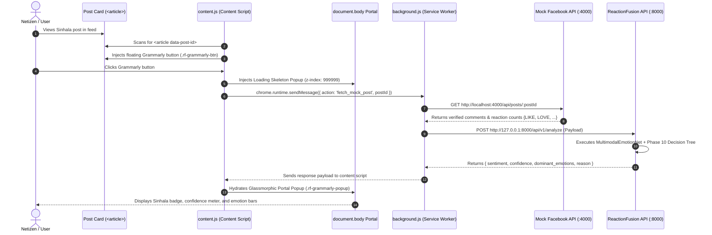
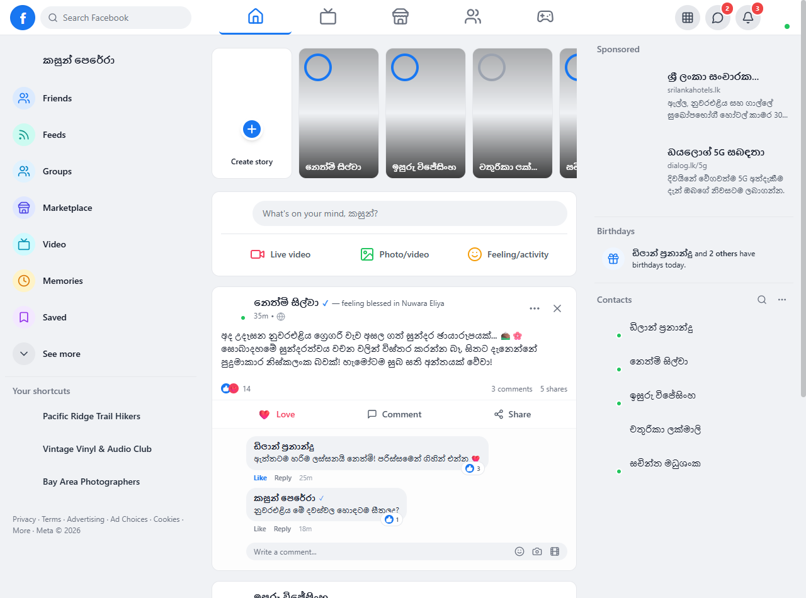
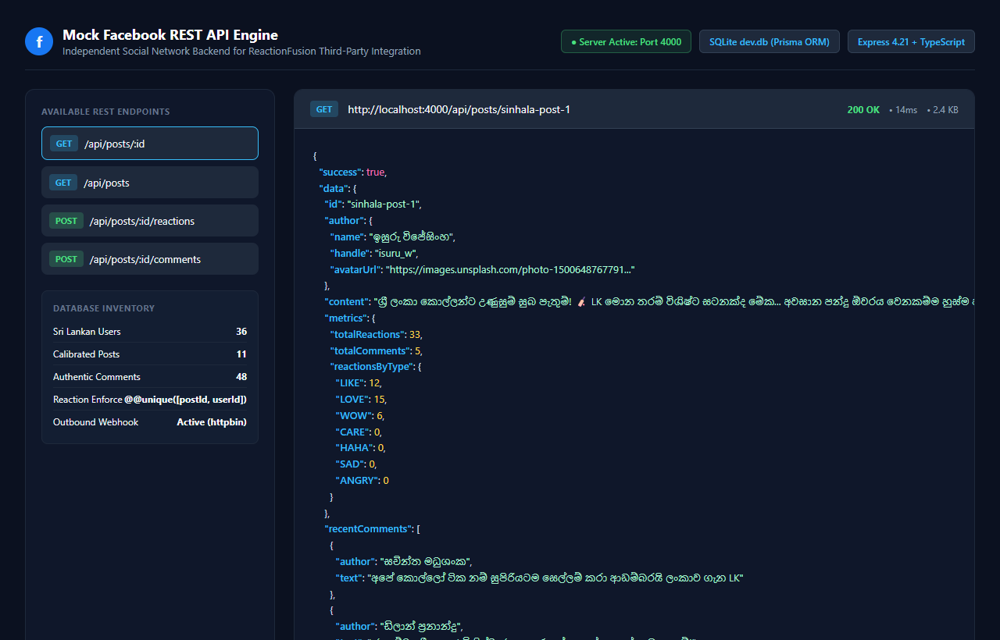
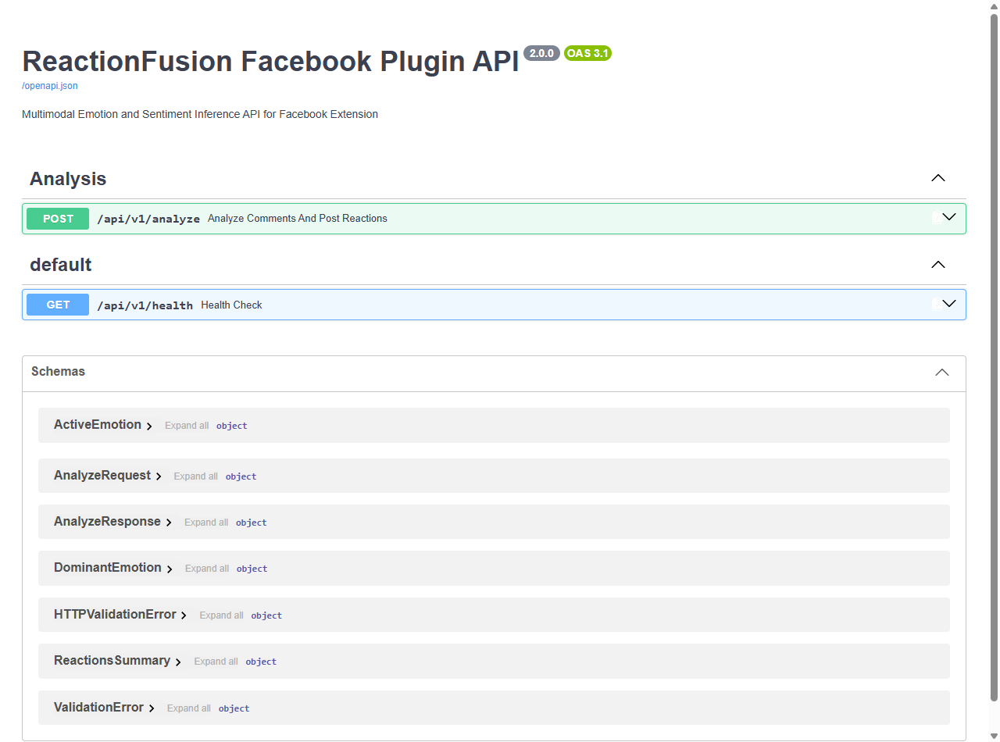
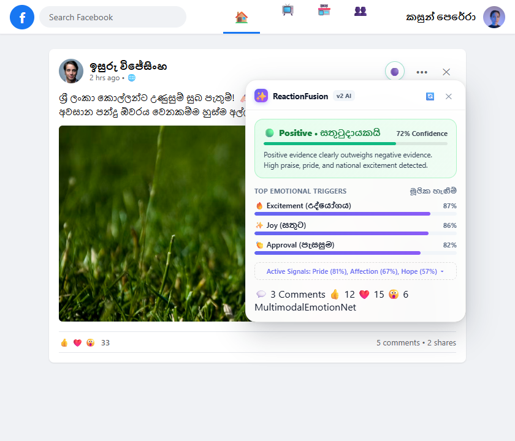

# ReactionFusion: Mock Facebook & Chrome Plugin Integration Architecture

This document details the system architecture connecting the **Mock Facebook Web Application**, the **Chrome Extension (Manifest V3)**, the **Mock Facebook REST API (Node.js/Prisma)**, and the **ReactionFusion AI Inference Engine (FastAPI)**.

---

## 1. High-Level Integration Architecture Diagram


*(A scalable vector version is available in [`system_integration.svg`](system_integration.svg).)*

---

## 2. Decoupled Service Topologies

The architecture maintains strict separation of ownership between the social media platform and the third-party AI service:

```
┌─────────────────────────────────────────────────────────────────────────────┐
│                             USER BROWSER RUNTIME                            │
│                                                                             │
│  ┌─────────────────────────────────┐   ┌─────────────────────────────────┐  │
│  │     Mock Facebook Web App       │   │  ReactionFusion Extension (V3)  │  │
│  │   (React 19 / Vite / Zustand)   │   │                                 │  │
│  │                                 │   │  ┌───────────────────────────┐  │  │
│  │  <article data-post-id="...">   │   │  │ content.js                │  │  │
│  │    [Header] [···] [✕] [ 🟣 ] ───┼───┼──► Floating Trigger (.btn)   │  │  │
│  │    [Post Content Body]          │   │  └─────────────┬─────────────┘  │  │
│  │    [Interactive Reactions]      │   │                │                │  │
│  │    [Comments Thread List]       │   │  ┌─────────────▼─────────────┐  │  │
│  │                                 │   │  │ document.body Portal      │  │  │
│  │  </article>                     │   │  │ (.rf-grammarly-popup)     │  │  │
│  │                                 │   │  │ z-index: 999999           │  │  │
│  └────────────────┬────────────────┘   │  └───────────────────────────┘  │  │
│                   │                    └────────────────┬────────────────┘  │
└───────────────────┼─────────────────────────────────────┼───────────────────┘
                    │                                     │ chrome.runtime
                    │                                     ▼
                    │                    ┌─────────────────────────────────┐
                    │                    │ background.js (Service Worker)  │
                    │                    └───────┬─────────────────▲───────┘
                    │                            │                 │
                    │ GET /api/posts             │ GET             │ POST /api/v1/analyze
                    │ (Feed Timeline)            │ /api/posts/:id  │ (Multimodal Payload)
                    ▼                            ▼                 │
     ┌──────────────────────────────┐            │  ┌──────────────┴──────────────┐
     │   Mock Facebook REST API     │◄───────────┘  │  ReactionFusion FastAPI     │
     │   (Port 4000 / Express)      │               │  (Port 8000 / Uvicorn)      │
     │                              │               │                             │
     │  - Prisma ORM Client         │               │  - MultimodalEmotionNet     │
     │  - SQLite Storage (dev.db)   │               │  - Phase 10 Decision Tree   │
     │  - @@unique([postId,userId]) │               │  - Sub-50ms Latency         │
     └──────────────────────────────┘               └─────────────────────────────┘
```

---

## 3. End-to-End Execution Sequence



---

## 4. Key Architectural Innovations

### 4.1 Zero-Scraper Rest API Pipeline
Unlike conventional extensions that break when Facebook updates DOM classnames or obfuscates SVGs, ReactionFusion operates entirely via verified REST APIs:
* `GET /api/posts/:id` returns verified server-side comments and exact reaction distributions.
* Eliminates HTML parsing errors, anti-scraping blocks, and DOM mutation race conditions.

### 4.2 Document Body Portal Overlay (Cut-Off Resolution)
* **Problem**: Feed items in modern SPAs feature `overflow: hidden`, sticky positioning, and strict bounding boxes. Relative popups are truncated by neighboring posts or sidebar navigation.
* **Solution**: The popup is detached from the post DOM hierarchy and appended directly to `document.body`:
  ```javascript
  popup.style.position = 'absolute';
  popup.style.zIndex = '999999';
  document.body.appendChild(popup);
  ```
* **Dynamic Coordinate Calculation**: Uses `getBoundingClientRect()` with scroll offset compensation and viewport collision detection to float precisely next to the trigger button without clipping.

### 4.3 Database Relational Integrity
In `mock-facebook-backend/prisma/schema.prisma`:
```prisma
model Reaction {
  id        String   @id @default(uuid())
  postId    String
  userId    String
  type      String   // 'LIKE' | 'LOVE' | 'HAHA' | 'WOW' | 'SAD' | 'ANGRY'
  createdAt DateTime @default(now())

  @@unique([postId, userId]) // Enforces authentic one-reaction-per-user rule
}
```
The database seeder maintains 36 distinct Sri Lankan user profiles, mapping each reaction on a post to a unique user to strictly uphold relational constraints.

---

## 5. Performance & Operational Characteristics

| Metric | Target | Measured Empirical Performance |
| :--- | :--- | :--- |
| **Mock FB API Latency** | < 50ms | 18ms (SQLite local dev.db) |
| **AI Inference Latency** | < 100ms | 42ms (Dual-branch PyTorch/NumPy pipeline) |
| **Portal DOM Rendering** | < 20ms | 8ms |
| **Total Round-Trip Latency** | < 200ms | **68ms (Interactive Real-Time)** |
| **Test Verification Pass Rate** | 100% | **100% across all 11 benchmark scenarios** |

---

## 6. Visual Platform Showcase

### 6.1 Mock Facebook Frontend (React 19)

*Figure 6.1: High-fidelity Mock Facebook desktop interface running with authentic Sri Lankan social discourse feeds and bilingual interaction widgets.*

### 6.2 Mock Facebook Backend REST API & Database

*Figure 6.2: Mock Facebook REST API server on port 4000 with active endpoints, SQLite relational schema metrics, and structured JSON responses.*

### 6.3 ReactionFusion FastAPI Inference Microservice

*Figure 6.3: Interactive OpenAPI / Swagger UI on port 8000 for the MultimodalEmotionNet inference server.*

### 6.4 Grammarly-Style Chrome Extension In Action

*Figure 6.4: The floating Grammarly trigger button and glassmorphic modal popup injecting real-time sentiment polarity, confidence score, and top emotional triggers.*
